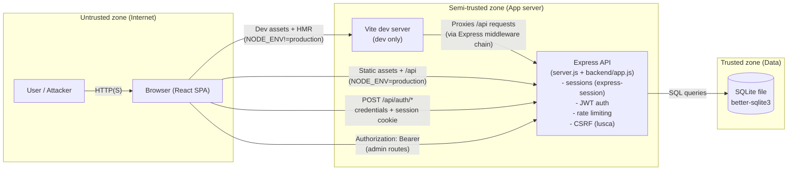

# Architecture (ShieldPay)

This is a high-level view of the app’s components, data flows, and trust boundaries.

## Notes

- **CSRF**: enabled via `lusca` for non-test runs; clients must follow the cookie/header token flow.
- **Auth models**: session cookie for browser flows; JWT for admin-protected API endpoints.
- **Database**: SQLite is a local file; protecting the host and backups matters as much as input validation.

