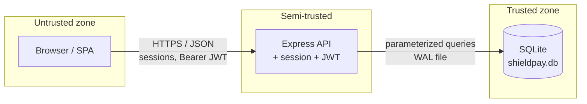

# ShieldPay — lightweight threat model

## Data flow (one page)

Top trust shift: anything the browser sends is assumed hostile; the API must enforce authn/z before touching merchant-scoped rows; SQLite is only as safe as the host disk and backups.

## Trust boundaries

| Zone        | Trust level | Notes                                      |
| ----------- | ------------ | ------------------------------------------ |
| Browser     | Untrusted    | User-controlled input, cookies, JS        |
| Express API | Semi-trusted | Authn/z, validation, session, JWT           |
| SQLite      | Trusted zone | File on disk; protect host + backups        |

## Primary assets

- Merchant sessions and JWTs
- Customer PII (demo) and fake payment artifacts (`ARKO-LAB-*` storage patterns)
- Admin vs merchant separation

## Representative abuse cases

1. **Broken access control** — one merchant accessing another’s customers or transactions (`ARKO-LAB-02`, `-03`).
2. **Sensitive data exposure** — APIs or logs returning PAN/CVV-style fields (`ARKO-LAB-04`, `-05`, `-09`).
3. **Weak crypto / secrets** — default JWT/session material (`ARKO-LAB-07`).
4. **Injection** — untrusted input reaching queries or commands (`ARKO-LAB-01`).
5. **Misconfiguration** — verbose errors, stack traces to clients (`ARKO-LAB-06`).

## Mitigations (production direction)

- Strong secrets via vault/KMS, no defaults in production builds.
- Token scope, RBAC, and object-level authorization tests in CI.
- Structured logging without sensitive fields; redact card data.
- Centralized WAF + rate limits at the edge for public deployments.

See `SECURITY-LAB.md` for the exercise checklist tied to `ARKO-LAB-*` markers in code.
